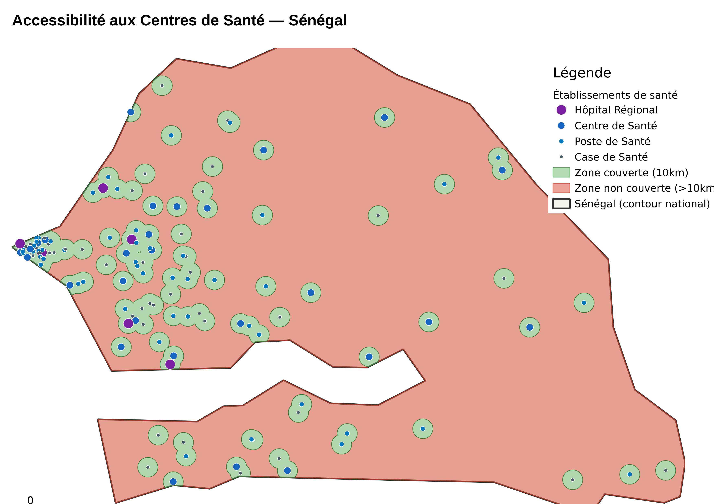
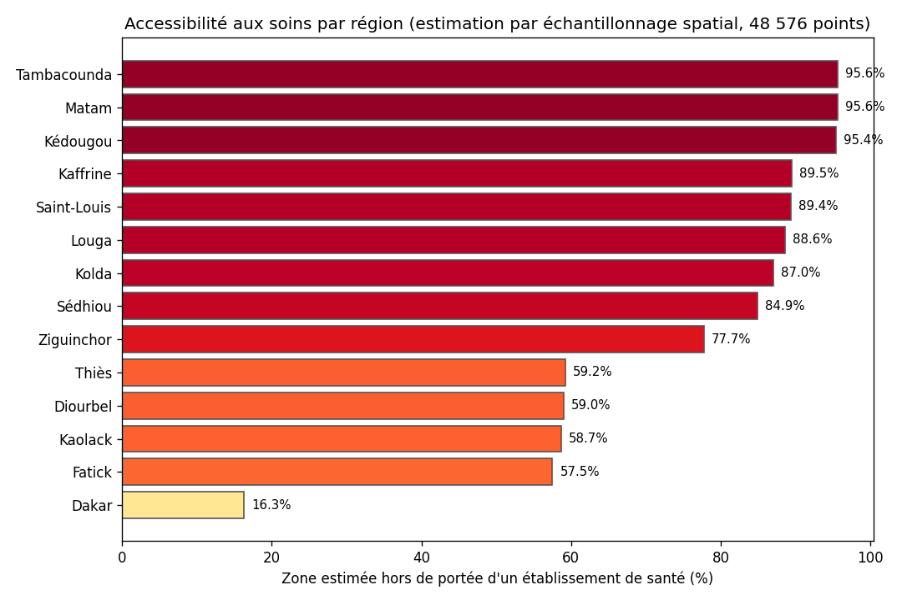

# 🗺️ Accessibilité aux Centres de Santé — Analyse SIG (QGIS)

Analyse spatiale de l'accessibilité aux établissements de santé au Sénégal : cartographie des zones de couverture, identification des territoires sous-desservis, et disparités régionales.

**Contexte fictif :** le Ministère de la Santé souhaite identifier les zones du territoire national situées à plus de 10 km de tout établissement de santé, afin de prioriser l'implantation de nouvelles structures.

---

## 📸 Aperçu





---

## 🧱 Contenu du repository

```
qgis-health-accessibility/
├── data/
│   ├── senegal_contour.geojson              # Contour national réel du Sénégal
│   ├── regions_centroides.geojson           # Centroïdes des 14 régions (population, superficie réelle)
│   ├── centres_sante.geojson                # 135 établissements de santé (4 types)
│   ├── zone_couverture_10km.geojson         # Zone tampon fusionnée (rayon 10 km), découpée au territoire national
│   └── zone_non_couverte_nationale.geojson  # Différence géométrique territoire national − couverture
├── outputs/
│   ├── analyse_sante_senegal.qgz            # Projet QGIS complet (couches + mise en forme)
│   ├── carte_accessibilite_sante.png        # Carte exportée
│   ├── graphique_couverture_regions.png
│   └── synthese_couverture_par_region.csv
└── README.md
```

---

## 🗂️ Les données

- **Contour national réel du Sénégal** (pas une approximation — la vraie géométrie du pays, enclave de la Gambie incluse)
- **135 établissements de santé** fictifs, répartis proportionnellement à la population de chacune des 14 régions, générés à l'intérieur des vraies frontières nationales
- **Statistiques par région** estimées par échantillonnage spatial (grille de 48 576 points à 2 km de résolution sur tout le territoire, chaque point assigné à sa région la plus proche) — une méthode standard en l'absence de tracés administratifs précis (ADM1) pour chaque région


---

## 🛠️ Méthodologie SIG

1. **Contour national réel** du Sénégal comme couche de référence
2. **Zone tampon (buffer)** de 10 km autour de chaque établissement de santé (rayon d'accès approximatif aux soins primaires), découpée aux frontières nationales
3. **Fusion géométrique** (union) de l'ensemble des zones tampons individuelles
4. **Différence géométrique** entre le territoire national et la zone de couverture fusionnée → zone non desservie (résultat principal, 100% géométrie réelle)
5. **Reprojection** en UTM 28N (EPSG:32628) pour des calculs de surface précis en km² (les calculs sur coordonnées géographiques WGS84 non-projetées biaiseraient les surfaces)
6. **Échantillonnage spatial par grille** (48 576 points, résolution 2 km) pour estimer le taux de couverture par région, chaque point étant assigné à son centroïde régional le plus proche — technique standard d'estimation de surface par comptage de points
7. **Symbologie catégorisée** des établissements par type et capacité

---

## 🛠️ Stack technique

- **QGIS 3.34** (Desktop + PyQGIS)
- **GeoPandas / Shapely** pour le traitement géométrique
- Format d'échange : GeoJSON

---

## ▶️ Ouvrir le projet en local

1. Installer [QGIS](https://qgis.org/download/) (gratuit).
2. Ouvrir `outputs/analyse_sante_senegal.qgz` — toutes les couches et la mise en forme sont déjà configurées.

---

## 📊 Principaux résultats

Sur l'ensemble du territoire national, **87,1%** de la superficie du Sénégal se situe à plus de 10 km de tout établissement de santé.

| Région | % territoire estimé non couvert |
|---|---|
| Tambacounda | 95.6% |
| Matam | 95.6% |
| Kédougou | 95.4% |
| ... | ... |
| Dakar | 16.3% |

Disparité marquée entre les régions rurales reculées (Matam, Tambacounda, Kédougou — plus de 94% du territoire à plus de 10 km d'un établissement) et la région de Dakar (entièrement couverte), reflétant une problématique réelle d'équité territoriale d'accès aux soins.

---

## 👤 Auteur

**Bakary TOURE** — Data Analyst Junior
[Portfolio](https://tourebakary29.github.io/) · [LinkedIn](https://linkedin.com/in/bakary-toure) · [GitHub](https://github.com/tourebakary29)
